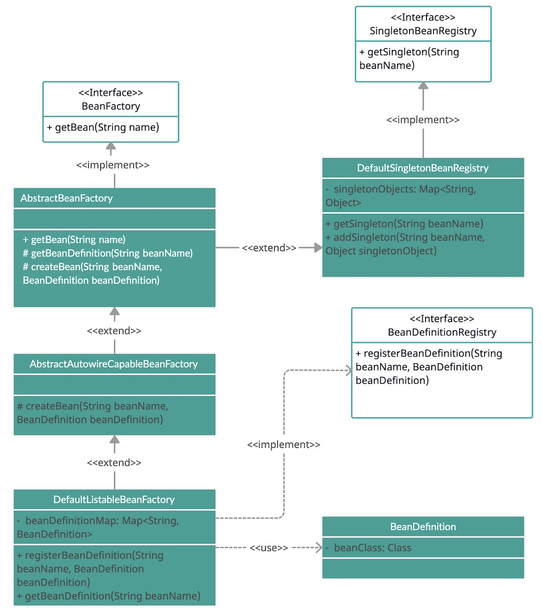

### Bean container UML class relationships

### Class explanation
Getting/Creating and Registering bean are defined as two different Interface (i.e., BeanFactory, BeanDefinitionRegistry)

The `AbstractBeanFactory` class not only has the functions defined in `DefaultSingletonBeanRegistry` class and also implements the `getBean` methods which is overrided from `BeanFactory` interface. The implentation of `getBean` method comprises two abstract methods, `createBean` and `getBeanDefinition`, which are template methods defined in this class, and is respectively implemented in `AbstractAutowireCapableBeanFactor` and `DefaultListableBeanFactory`.

The `createBean` method implemented in `AbstractAutowireCapableBeanFactory` creates bean with passed in bean definition. After instantiation, it then adds to the singleton container defined in `DefaultSingletonBeanRegistry`, and return bean.

There are two functions in `DefaultListableBeanFactory`, one is the `getBeanDefinition` which was mentioned above, which simply get `beanDefinition` from container by name; the `registerBeanDefinition` function put (bean name : bean definition) entry into the container.

### Workflow of getBean

The bean is not instantiated in the process of registry, but created when it is called at the first time. This method is implemented in `AbstractBeanFactory` class, and it will call `getBeanDefinition` and `createBean` functions defined in its child class. It gets bean definition from the container in `DefaultListableBeanFactory`, and invoke `createBean` in `AbstractAutowireCapableBeanFactory`.