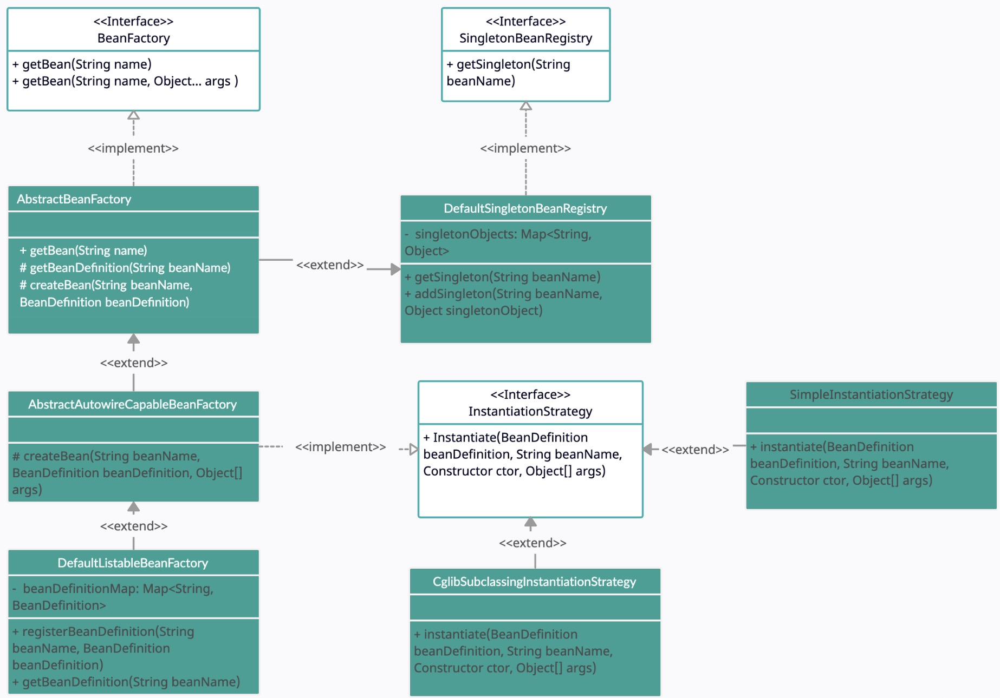

### Updates

Add InstantiationStrategy interface and implement different strategies (i.e., cglib, DeclaredConstructor) to enable instantiating with arguments.

### Flaws

What if the instantiated class comprised properties that also need to be instantiated?