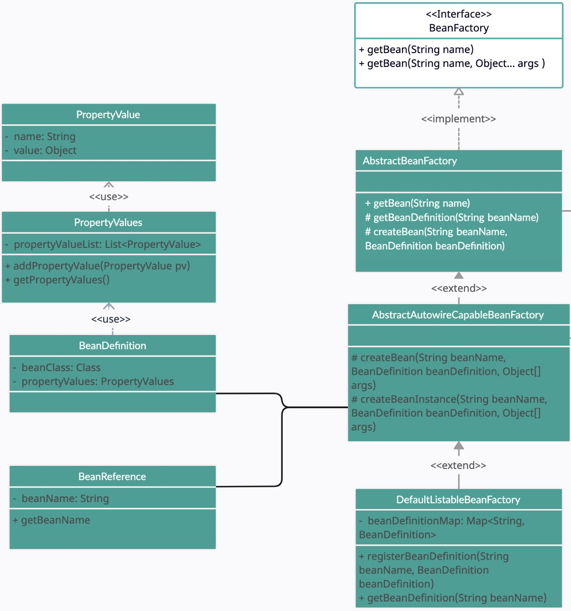

### Updates

Add three classes: `BeanReference`, `PropertyValue`, `PropertyValues`

Add filling properties operation in `createBean` method in `AbstractAutowireCapableBeanFactory`.

Add `PropertyValues` into `BeanDefinition`

Add `applyPropertyValues` function in `AbstractAutowireCapableBeanFactory`, which will be called after creating beans.

### Notes

The `BeanReference` is used as the `value` field in `PropertyValue`. When `applyPropertyValues`, the program checks each property if it was a regular value or `BeanReference`; if it was `BeanReference`, it means this instance depends on another instance, which will then invoke another round of `createBean` if the dependent bean had not bean instantiated yet, and might lead another round of `applyPropertyValues`.

### Flaws

Now the bean is created 'manually' in test file. How to write the definition in the XML file, and load the bean as Spring does?
