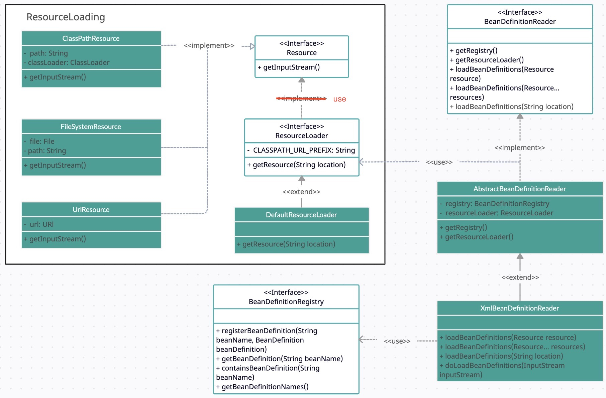
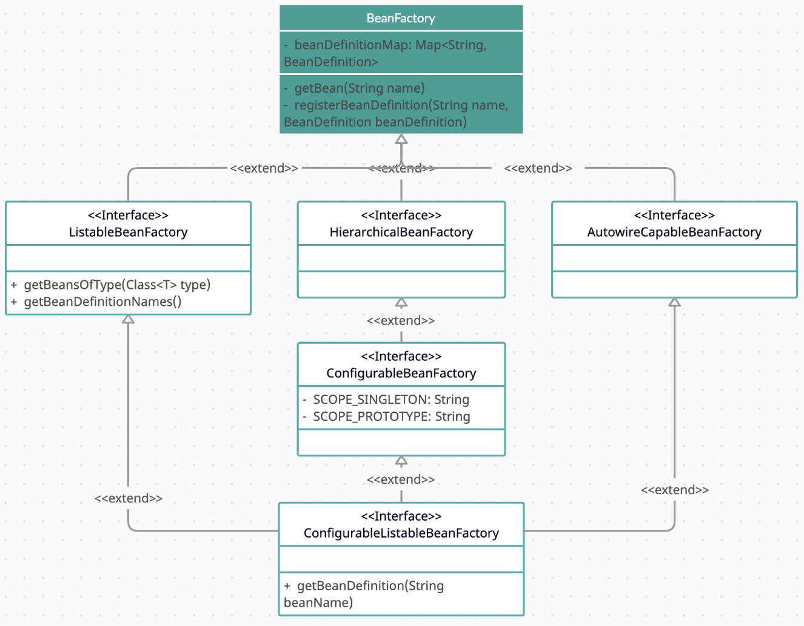

### Updates

* Add loading resource component which can handle classpath resource, local file, and cloud resource.
* Add three methods in `BeanDefinitionRegistry` interface, and implemented in `DefaultListableBeanFactory`.
* Add `BeanDefinitionReader` interface, implemented by `AbstractBeanDefinitionReader` class, which are used for loading external class file using `ResourceLoader` componentand ,and register in container using BeanDefinitionRegistry.
* Add `XMLBeanDefinitionReader` class, which extends `AbstractBeanDefinitionReader` and is dedicated to loading XML file. The `doLoadBeanDefinitions` function parses the input stream (i.e., the xml config file) and register the bean.

* Add `ListableBeanFactory` interface, which is now able to get bean by class type
